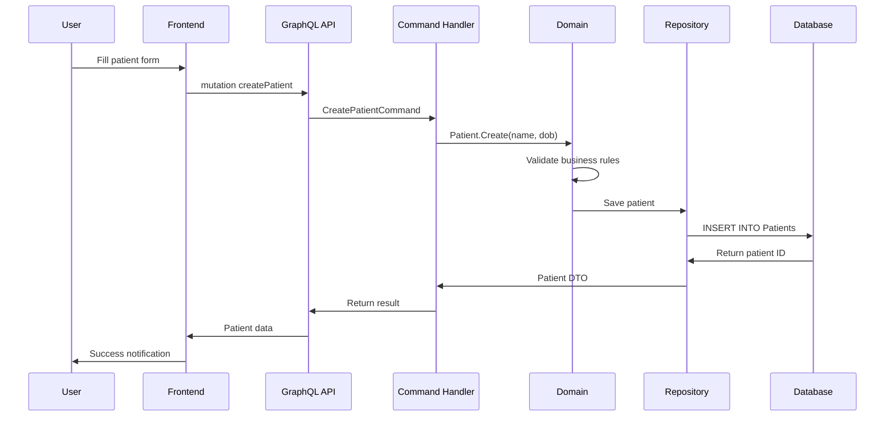
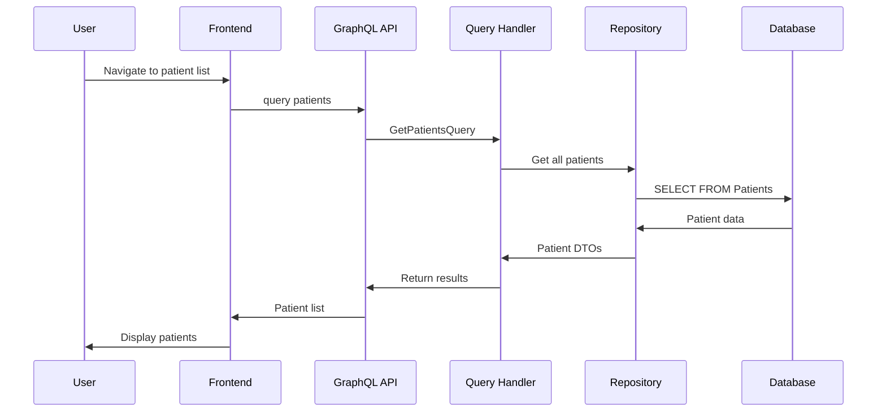

# HealthHub - System Architecture

## Overview

HealthHub is a full-stack patient management application built on modern architecture with emphasis on modularity, scalability, and maintainability. The application combines ASP.NET Core backend with TypeScript React frontend and utilizes GraphQL API for efficient communication.

## System Architecture Diagram

```mermaid
graph TB
    subgraph "Frontend Layer"
        A[React Components] --> B[Apollo Client]
        B --> C[GraphQL API Calls]
        A --> D[Authentication Service]
        D --> E[JWT Token Management]
    end
    
    subgraph "Presentation Layer"
        C --> F[HotChocolate GraphQL]
        F --> G[Query Resolvers]
        F --> H[Mutation Resolvers]
        G --> I[CQRS Handlers]
        H --> I
    end
    
    subgraph "Application Layer"
        I --> J[Command Handlers]
        I --> K[Query Handlers]
        J --> L[Domain Entities]
        K --> L
    end
    
    subgraph "Domain Layer"
        L --> M[Business Rules]
        L --> N[Value Objects]
        M --> O[Patient Entity]
        M --> P[DiagnosticResult Entity]
        N --> Q[PatientName VO]
        N --> R[Diagnosis VO]
    end
    
    subgraph "Infrastructure Layer"
        L --> S[Repository Interfaces]
        S --> T[EF Core Repositories]
        T --> U[PostgreSQL Database]
        U --> V[(Patients Table)]
        U --> W[(DiagnosticResults Table)]
    end
    
    subgraph "External Services"
        X[JWT Authentication] --> D
        Y[Health Checks] --> Z[/health endpoint]
    end
    
    A --> F
    D --> X
```

## Architectural Patterns

### Clean Architecture (Pragmatic Approach)

The application implements Pragmatic Clean Architecture with clear layer separation:

1. **Domain Layer** - Core business logic, entities, value objects
2. **Application Layer** - Use cases, CQRS handlers, DTOs
3. **Infrastructure Layer** - Data access, external services
4. **Presentation Layer** - API, UI, external interfaces

### Domain-Driven Design (DDD)

- **Entities**: `Patient`, `DiagnosticResult` with encapsulated business logic
- **Value Objects**: `PatientName`, `Diagnosis` for validation and immutability
- **Aggregates**: Patient as aggregate root with DiagnosticResults

### CQRS (Command Query Responsibility Segregation)

- **Commands**: Mutating operations (`CreatePatientCommand`, `AddDiagnosticResultCommand`)
- **Queries**: Read operations (`GetPatientsQuery`, `GetPatientByIdQuery`)
- **Separate handlers** for better scalability and performance

## Technology Stack Justification

### Backend Technology Choices

| Technology | Choice | Alternatives Considered | Reason for Choice |
|------------|--------|-------------------------|-------------------|
| **.NET 10.0** | ✅ | Node.js, Java, Python | Performance, type safety, enterprise readiness |
| **HotChocolate GraphQL** | ✅ | GraphQL.NET, custom implementation | Code-first approach, built-in filtering/sorting |
| **Entity Framework Core** | ✅ | Dapper, raw SQL | Productivity, LINQ support, migration tools |
| **PostgreSQL** | ✅ | SQL Server, MySQL | Open source, JSON support, performance |

### Frontend Technology Choices

| Technology | Choice | Alternatives Considered | Reason for Choice |
|------------|--------|-------------------------|-------------------|
| **React 18 + TypeScript** | ✅ | Vue, Angular, Svelte | Ecosystem, type safety, performance |
| **Next.js 14** | ✅ | Create React App, Vite | SSR/SSG, App Router, built-in optimizations |
| **Apollo Client** | ✅ | URQL, React Query | GraphQL expertise, caching, error handling |
| **Tailwind CSS** | ✅ | CSS Modules, Styled Components | Utility-first, consistency, rapid development |

## Data Flow Sequences

### Sequence 1: Patient Creation Workflow



### Sequence 2: Patient List Retrieval



## Database Schema

### Patients Table
```sql
CREATE TABLE Patients (
    Id UUID PRIMARY KEY DEFAULT gen_random_uuid(),
    FirstName VARCHAR(50) NOT NULL,
    LastName VARCHAR(50) NOT NULL,
    DateOfBirth DATE NOT NULL,
    CreatedAt TIMESTAMP NOT NULL DEFAULT NOW(),
    UpdatedAt TIMESTAMP NULL
);
```

### DiagnosticResults Table
```sql
CREATE TABLE DiagnosticResults (
    Id UUID PRIMARY KEY DEFAULT gen_random_uuid(),
    PatientId UUID NOT NULL REFERENCES Patients(Id) ON DELETE CASCADE,
    Diagnosis VARCHAR(200) NOT NULL,
    Notes TEXT NULL,
    TimestampUtc TIMESTAMP NOT NULL DEFAULT NOW(),
    CreatedAt TIMESTAMP NOT NULL DEFAULT NOW()
);
```

## Security Architecture

### Authentication Flow
1. **JWT Token Issuance** - `/auth/token` endpoint for obtaining tokens
2. **Token Validation** - HotChocolate authorization with `[Authorize]` attribute
3. **Role-Based Access** - Preparation for future role extensions

### Data Protection
- **Input Validation** - Domain validation in entities
- **SQL Injection Protection** - EF Core parameterized queries
- **XSS Protection** - React automatic escaping
- **CORS Configuration** - Strict origin policy

## Performance Considerations

### Backend Optimizations
- **EF Core Tracking** - `AsNoTracking()` for read operations
- **Query Optimization** - Efficient LINQ queries
- **Caching Strategy** - HotChocolate built-in caching

### Frontend Optimizations
- **Code Splitting** - Next.js automatic splitting
- **GraphQL Caching** - Apollo Client cache management
- **Bundle Optimization** - Tree shaking and minification

## Scalability Strategy

### Vertical Scaling
- **Containerization** - Docker for easy deployment
- **Resource Management** - Efficient memory usage
- **Database Optimization** - Indexes and query tuning

### Horizontal Scaling (Future)
- **Microservices** - Splitting into specialized services
- **API Gateway** - GraphQL federation
- **Caching Layer** - Redis for session management

## Monitoring and Observability

### Health Checks
- **Database Connectivity** - EF Core health check
- **API Status** - Custom health endpoint
- **Container Health** - Docker health checks

## Deployment Architecture

### Development Environment
- **Local Development** - Docker Compose with hot reload
- **Development Server** - Separate frontend/backend servers
- **Database** - Local PostgreSQL instance

### Production Environment
- **Single Container** - Integrated frontend/backend
- **Database** - Managed PostgreSQL service
- **Load Balancer** - Reverse proxy configuration

---

This architecture provides a solid foundation for current needs and allows future expansion according to growing requirements.