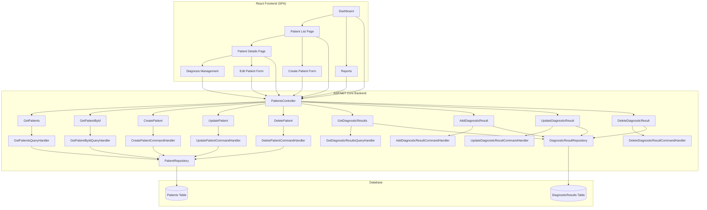

# HealthHub Patient Management System - Architecture Plan

## Overview
This document outlines the comprehensive architecture for implementing patient and diagnosis management functionality in the HealthHub application, integrating TypeScript React frontend with ASP.NET Core backend.

## System Architecture



## Backend API Endpoints

### Patients Controller (`/api/patients`)
- **GET** `/` - Get all patients (with search, pagination)
- **GET** `/{id}` - Get patient by ID
- **POST** `/` - Create new patient
- **PUT** `/{id}` - Update patient
- **DELETE** `/{id}` - Delete patient
- **GET** `/count` - Get patient count
- **GET** `/{id}/diagnoses` - Get patient diagnoses
- **POST** `/{id}/diagnoses` - Add diagnosis to patient
- **PUT** `/diagnoses/{diagnosisId}` - Update diagnosis
- **DELETE** `/diagnoses/{diagnosisId}` - Delete diagnosis

### Required DTOs
- `CreatePatientDto` - For patient creation
- `UpdatePatientDto` - For patient updates  
- `AddDiagnosticResultDto` - For adding diagnoses
- `UpdateDiagnosticResultDto` - For updating diagnoses

## Frontend React Components

### Page Components
1. **PatientListPage** - Main patient listing with search/filter
2. **PatientDetailsPage** - Individual patient view with diagnoses
3. **CreatePatientPage** - Patient creation form
4. **EditPatientPage** - Patient editing form
5. **DashboardPage** - Patient statistics and overview
6. **ReportsPage** - Diagnosis reporting and analytics

### Component Structure
```
components/
├── patients/
│   ├── PatientList.tsx
│   ├── PatientCard.tsx
│   ├── PatientForm.tsx
│   ├── PatientSearch.tsx
│   └── PatientFilters.tsx
├── diagnoses/
│   ├── DiagnosisList.tsx
│   ├── DiagnosisCard.tsx
│   ├── DiagnosisForm.tsx
│   └── DiagnosisTimeline.tsx
├── shared/
│   ├── LoadingSpinner.tsx
│   ├── ErrorMessage.tsx
│   ├── SuccessMessage.tsx
│   └── ConfirmationDialog.tsx
└── layout/
    ├── Header.tsx
    ├── Sidebar.tsx
    └── Footer.tsx
```

### API Integration Layer
```typescript
// services/patientService.ts
export interface PatientService {
  getPatients(params?: SearchParams): Promise<Patient[]>
  getPatientById(id: string): Promise<PatientDetail>
  createPatient(patient: CreatePatientData): Promise<Patient>
  updatePatient(id: string, patient: UpdatePatientData): Promise<Patient>
  deletePatient(id: string): Promise<void>
  getPatientDiagnoses(patientId: string): Promise<Diagnosis[]>
  addDiagnosis(patientId: string, diagnosis: AddDiagnosisData): Promise<Diagnosis>
  updateDiagnosis(diagnosisId: string, diagnosis: UpdateDiagnosisData): Promise<Diagnosis>
  deleteDiagnosis(diagnosisId: string): Promise<void>
}
```

## Data Models

### Patient Model (Frontend)
```typescript
interface Patient {
  id: string
  firstName: string
  lastName: string
  fullName: string
  dateOfBirth: string
  age: number
  lastDiagnosis?: string
  createdAt: string
  updatedAt?: string
}

interface PatientDetail extends Patient {
  diagnosticResults: Diagnosis[]
}

interface Diagnosis {
  id: string
  patientId: string
  diagnosis: string
  notes?: string
  timestampUtc: string
  createdAt: string
}
```

## Form Validation

### Patient Form Validation Rules
- **FirstName**: Required, min 2 characters, max 50 characters
- **LastName**: Required, min 2 characters, max 50 characters  
- **DateOfBirth**: Required, valid date, not in future
- **Contact Information**: Optional, validate format if provided

### Diagnosis Form Validation Rules
- **Diagnosis**: Required, min 3 characters, max 200 characters
- **Notes**: Optional, max 1000 characters
- **Timestamp**: Required, valid date

## Responsive Design Requirements

### Breakpoints
- **Mobile**: < 768px
- **Tablet**: 768px - 1024px  
- **Desktop**: > 1024px

### Mobile-First Components
- Collapsible patient cards on mobile
- Stacked form layouts on mobile
- Touch-friendly buttons and controls
- Optimized table views for mobile

## Security & Access Control

### Authentication
- JWT token-based authentication
- Token refresh mechanism
- Protected API endpoints with `[Authorize]` attribute

### Authorization
- Role-based access control (Admin, Doctor, Nurse)
- Permission-based feature access
- Audit logging for sensitive operations

## Error Handling & User Experience

### API Error Handling
- Standardized error responses
- HTTP status code mapping
- User-friendly error messages
- Retry mechanisms for failed requests

### UI Error States
- Loading states for async operations
- Error boundaries for component failures
- Form validation feedback
- Success/error notifications

## Testing Strategy

### Backend Tests
- Unit tests for handlers and repositories
- Integration tests for API endpoints
- Database integration tests

### Frontend Tests
- Unit tests for components and services
- Integration tests for user workflows
- E2E tests for critical paths

## Deployment Considerations

### Build Process
- Separate build scripts for frontend and backend
- Docker containerization
- Environment-specific configurations

### Performance Optimization
- Frontend code splitting
- API response caching
- Database query optimization
- Static asset optimization

## Implementation Priority

### Phase 1: Core Patient Management
1. Complete PatientsController API endpoints
2. Implement PatientListPage and PatientDetailsPage
3. Create basic patient CRUD operations

### Phase 2: Diagnosis Management  
1. Implement diagnosis API endpoints
2. Create diagnosis management components
3. Add diagnosis timeline and history

### Phase 3: Advanced Features
1. Implement search and filtering
2. Create dashboard and reporting
3. Add role-based access control
4. Implement data export functionality

### Phase 4: Polish & Optimization
1. Performance optimization
2. Accessibility improvements
3. Comprehensive testing
4. Documentation updates

## Success Metrics
- All CRUD operations functional
- Responsive design working on all devices
- API integration with proper error handling
- User-friendly interface with accessibility compliance
- Performance benchmarks met (page load < 2s, API response < 200ms)