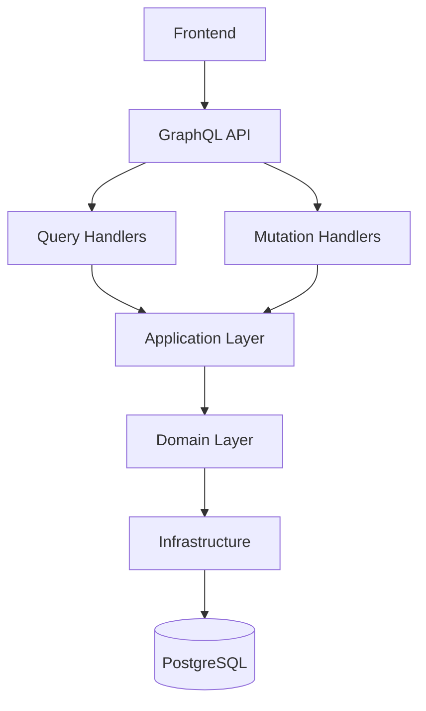

# HealthHub - Pragmatic Clean Architecture with DDD + CQRS

## Project Overview
Full-stack patient management application with GraphQL API, implementing modular monolith architecture.

## Architecture Layers

### 1. Domain Layer (Core Business Logic)
- **Entities**: Patient, DiagnosticResult (enhanced with domain logic)
- **Value Objects**: Age, Diagnosis, PatientName
- **Domain Services**: PatientRegistrationService, DiagnosisService
- **Repository Interfaces**: IPatientRepository, IDiagnosticResultRepository

### 2. Application Layer (Use Cases)
- **Commands**: CreatePatientCommand, UpdateDiagnosisCommand
- **Queries**: GetPatientsQuery, GetPatientDetailsQuery
- **Handlers**: CommandHandlers, QueryHandlers
- **DTOs**: PatientDto, DiagnosticResultDto

### 3. Infrastructure Layer (External Concerns)
- **Data Access**: EF Core implementations, HealthHubDbContext
- **Repositories**: PatientRepository, DiagnosticResultRepository
- **Authentication**: JWT service, User management
- **External Services**: (Future extensions)

### 4. Presentation Layer (API & Frontend)
- **GraphQL API**: Queries, Mutations, Types
- **Controllers**: (Optional REST endpoints)
- **Frontend**: HTML/CSS/JavaScript SPA

## Project Structure
```
HealthHub/
├── Domain/
│   ├── Entities/
│   ├── ValueObjects/
│   ├── Services/
│   └── Interfaces/
├── Application/
│   ├── Commands/
│   ├── Queries/
│   ├── Handlers/
│   └── DTOs/
├── Infrastructure/
│   ├── Data/
│   ├── Repositories/
│   ├── Authentication/
│   └── Services/
├── Presentation/
│   ├── GraphQL/
│   ├── Controllers/ (optional)
│   └── wwwroot/ (frontend)
└── Tests/
    ├── Domain.Tests/
    ├── Application.Tests/
    └── Integration.Tests/
```

## CQRS Implementation


## Key Features to Implement

### GraphQL API
- **Queries**: 
  - `patients`: List with basic info (name, age, last diagnosis)
  - `patient(id)`: Detailed patient with diagnostic history
- **Mutations**:
  - `createPatient`: Register new patient
  - `updateDiagnosis`: Add/update diagnostic results

### Frontend Features
- Patient list view with search/filter
- Patient detail view with diagnostic history
- Forms for creating patients and adding diagnoses
- JWT authentication interface

### Security
- JWT-based authentication
- Authorization for sensitive operations
- Input validation and sanitization

## Docker Setup
- Multi-container setup with .NET API and PostgreSQL
- Environment configuration for different environments
- Health checks and proper service dependencies